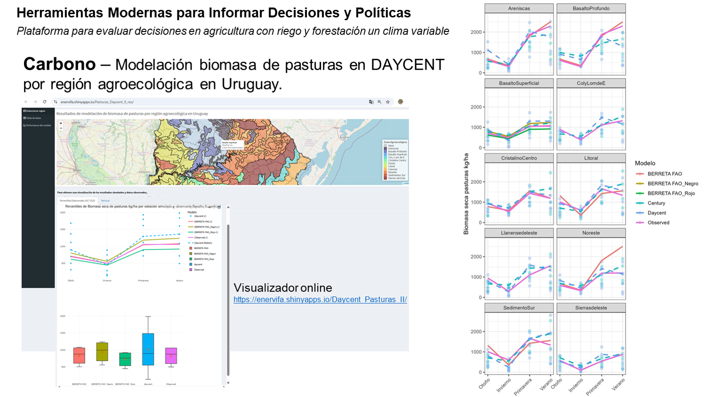

**ViSimPasturas-Uruguay** is an interactive **RShiny app** for visualizing pasture biomass simulations in Uruguay across agroecological regions. Simulations were generated using **DayCent** model, covering a period of 92 years (1930–2021). This tool provides valuable insights into forage availability over time and space, supporting livestock planning and resource management.

**🚀 Link to the app:**  https://enervifa.shinyapps.io/Daycent_Pasturas_II/

---

## 🌱 Key Features

- Biomass simulations (kg/ha) for natural pastures by **agroecological region** and **dominant soils**
- Yearly and seasonal summaries 
- Quantile-based summaries supporting planning management
- Simple **interactive visualization** using **RShiny**
- Integration of zone shapefiles for geographic context of the user

---

## Repository Structure
ViSimPasturas-Uruguay/

├── app.R                              # Main Shiny app file

├── README.md                          # This file

├── daycent_data.csv                   # Simulated pasture production data (yearly)

├── percentiles_decenfeb.csv          # Quantile summaries for Feb–Dec

├── observed.csv                       # Observed or comparative biomass data

├── overlay_stats_R.xlsx              # Statistical comparison outputs (e.g. vs CONEAT)

├── zonas_agroecologicas_latlon_SecPol# Agroecological shapefile data

├── Agroecol por suelos/              # Supplementary zone-soil mapping (folder)

└── LICENSE                            # MIT license

---

📸 Preview 

👥 Authors
Eliana Nervi Faggiani & Walter Baethgen
Instituto Nacional de Investigaci´on Agropecuaria (INIA), Proyecto FPTA 358, Montevideo, Uruguay

---

